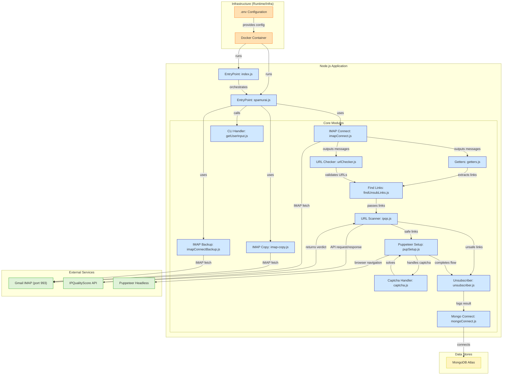

# 🥷 Spamurai

_A clean inbox is a sharp mind. Spamurai is here to forge the blade._

🚀 **Project Status:** Actively under development  
⚠️ **Note:** Experimental—use at your own risk. Always back up important mail.

---

## 📦 Repo & Entry Point

Clone & run the main script:

```bash
git clone https://github.com/nakuldevmv/Spamurai.git
cd Spamurai/backend
```

The entry point is `backend/index.js`.

---

## 1. 🔥 Introduction

Spamurai is your digital bushido—a script that slices through spam like a katana through chaos. It:

- Fetches mail via IMAP (Gmail ready)  
- Auto‑detects & clicks unsubscribe links 🪄  
- Moves unwanted mail to Trash (or nukes it ☠️)  
- Logs every strike to MongoDB Atlas  

---

## 2. 🧰 Prerequisites

- **Node.js** (v16+)  
- **npm** or **yarn**  
- **MongoDB Atlas** cluster  
- **Google App Password** (for IMAP access)  
- **IPQualityScore** API key (for link safety checks)  

---

## 3. 🔐 Environment Setup

Copy the example environment file and fill in your own values:

```bash
cp example.env .env
```

**Fill out `.env` like this:**

```dotenv
# Gmail IMAP (App Password)
EMAIL='you@gmail.com'
PASSWORD='your_16_digit_app_password'
PORT=993
HOST='imap.gmail.com'

# URL safety scanner (IPQualityScore)
IPQ_API='your_ipqs_api_key'

# MongoDB Atlas
DB_USERNAME='your_db_user'
DB_PASSWORD='your_db_password'
CLUSTER='your_cluster_url'   # e.g. spamurai.gjpxkae.mongodb.net
DB_NAME='spamurai'
DB_COLLECTION='scanned_links'
DB_COLLECTION2='unsubedLink'
```

> 🔒 **Never commit** your real `.env`—keep it in `.gitignore`.

---

## 4. 🛠️ Install & Run

```bash
# from Spamurai/backend
npm install      # or yarn install
npm start        # or node index.js
```

---

## 5. 🧠 How It Works

1. **IMAP Connect** — Logs into your Gmail inbox  
2. **Filter** — Skips flagged or important mail  
3. **Extract** — Finds unsubscribe links in each email  
4. **Verify** — Checks links via IPQualityScore (or cache)  
5. **Execute** — Clicks safe links, logs to MongoDB  
6. **Cleanup** — Moves processed messages to Trash (optional delete)

---

## 6. ⚠️ Warnings & Disclaimer

- Spamurai is still in training—no warranties.  
- It **only** clicks links marked safe.  
- Double‑check your `.env` before you run.  
- Backup your inbox if you’re feeling paranoid.

---
## 7. 📊 Working Flowchart

## 7. 🗺️ Roadmap

- [x] Smarter unsubscribe link detection   
- [x] Advanced link‑safety heuristics & fallbacks  
- [x] A Simple UI for I/O  
- [ ] OAuth2 support for Gmail (drop app passwords)  

---

## 8. 🎁 Extras & Pro Tips

- Whitelist VIP senders to avoid friendly fire  
- Helpful docs:  
  - [node‑imap](https://github.com/mscdex/node-imap)  
  - [mailparser](https://github.com/nodemailer/mailparser)  
  - [puppeteer](https://pptr.dev/)  
  - [IPQualityScore API](https://www.ipqualityscore.com/documentation)  

> _Spamurai bows, sheaths the blade, and fades into the shadows..._  
